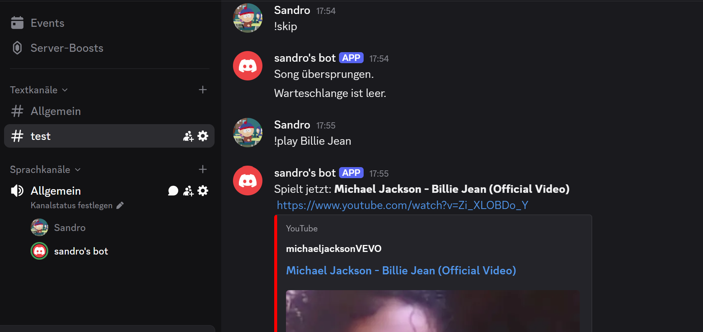

# Discord-bot

Dies ist ein einfacher Discord-Bot, der auf Nachrichten in einem Discord-Server reagieren kann. Der Bot nutzt Python und
die discord.py-Bibliothek, um Nachrichten zu verarbeiten und eine Antwort zurückzusenden.
Folgende 

# Python-Bibliotheken:
<ul> 
    <li>discord.py</li>
    <li>python-dotenv </li> 
</ul>
